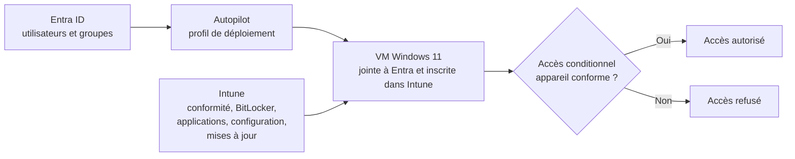

<!-- Remplace chaque ligne "📸" par ta capture :  -->

# Lab Entra ID & Intune : gérer un poste Windows 11 de bout en bout


Ce lab montre, pas à pas, comment une entreprise peut **créer ses utilisateurs, déployer un PC Windows 11 sans l'installer à la main, le chiffrer, y installer des applications, lui appliquer des règles, puis refuser l'accès aux données de l'entreprise aux appareils qui ne respectent pas ces règles**. Tout se fait dans le cloud Microsoft (Entra ID et Intune), sur un tenant d'essai, avec une machine virtuelle.

Le guide est écrit pour quelqu'un qui n'a **jamais utilisé Intune** : chaque étape précise où cliquer, quoi saisir, ce que tu dois voir ensuite et comment vérifier que ça a marché.

---

## Sommaire

1. [Présentation et vocabulaire](#1-présentation-et-vocabulaire)
2. [Architecture et prérequis](#2-architecture-et-prérequis)
3. [Étape 1 : tenant, utilisateurs et groupes](#3-étape-1--tenant-utilisateurs-et-groupes)
4. [Étape 2 : Windows Autopilot](#4-étape-2--windows-autopilot)
5. [Étape 3 : conformité et BitLocker](#5-étape-3--conformité-et-bitlocker)
6. [Étape 4 : déploiement d'applications](#6-étape-4--déploiement-dapplications)
7. [Étape 5 : Settings Catalog et Update Rings](#7-étape-5--settings-catalog-et-update-rings)
8. [Étape 6 : accès conditionnel](#8-étape-6--accès-conditionnel)
9. [Problèmes rencontrés et solutions](#9-problèmes-rencontrés-et-solutions)
10. [Limites et pistes d'amélioration](#10-limites-et-pistes-damélioration)
11. [Liens avec mes autres labs](#11-liens-avec-mes-autres-labs)

---

## 1. Présentation et vocabulaire

### 1.1 Ce que le lab démontre

| Étape | Ce que tu mets en place | Résultat visible |
|---|---|---|
| 1 | Utilisateurs et groupes dans Entra ID | Groupes qui se remplissent automatiquement |
| 2 | Windows Autopilot | Un PC qui se configure seul à la première connexion |
| 3 | Conformité et BitLocker | Un rapport « 8 règles sur 8 conformes » |
| 4 | Applications (Notepad++, Microsoft 365) | Applications installées sans intervention |
| 5 | Settings Catalog et Update Rings | Une clé USB bloquée en écriture, des mises à jour pilotées |
| 6 | Accès conditionnel | Un PC non géré est refusé, la VM conforme passe |

**Source d'inspiration** : ce lab s'inspire du dépôt [`DiCR77/Entra-Intune-Enterprise-Architecture`](https://github.com/DiCR77/Entra-Intune-Enterprise-Architecture). Je n'ai pas modifié sa conception : je l'ai réalisé sur mon propre tenant et documenté étape par étape, avec les problèmes rencontrés.

### 1.2 Vocabulaire (à lire avant de commencer)

| Terme | Explication simple |
|---|---|
| **Microsoft Entra ID** | L'annuaire cloud de Microsoft : il contient les utilisateurs, les groupes et les appareils. Anciennement « Azure AD ». |
| **Intune** | Le service qui **gère** les appareils : il leur envoie des règles, des applications et des mises à jour. |
| **Tenant** | Ton espace dédié chez Microsoft (ex. `monentreprise.onmicrosoft.com`). |
| **MDM** | *Mobile Device Management* : la gestion d'un appareil par un serveur (ici Intune). Un appareil « inscrit » est un appareil géré. |
| **Portée MDM** | Réglage qui dit **qui** a le droit d'inscrire son appareil dans Intune. Sur « Aucun », rien ne s'inscrit. |
| **Groupe dynamique** | Groupe dont les membres sont calculés automatiquement par une règle (ex. « service = IT »). On ne peut pas y ajouter quelqu'un à la main. |
| **Windows Autopilot** | Méthode de déploiement : l'appareil est enregistré à l'avance, et à son premier démarrage il se configure seul avec le compte de l'utilisateur. |
| **OOBE** | *Out-Of-Box Experience* : les écrans du premier démarrage de Windows (langue, clavier, réseau, connexion). |
| **ESP** | *Enrollment Status Page* : la page qui affiche la progression pendant que Windows installe les profils et les applications. |
| **Hash matériel** | « Empreinte » de l'appareil, envoyée à Autopilot pour qu'il le reconnaisse au démarrage. |
| **Conformité** | Liste de règles de sécurité (chiffrement, antivirus…). Un appareil qui les respecte toutes est « conforme ». |
| **TPM** | Puce de sécurité (ici virtuelle) qui protège les clés de chiffrement. |
| **Secure Boot** | Démarrage sécurisé : empêche de lancer un système modifié. |
| **BitLocker** | Chiffrement du disque de Windows. |
| **Win32 / `.intunewin`** | Format de paquet pour déployer une application classique (`.msi`, `.exe`) avec Intune. |
| **Update Ring** | Réglages de Windows Update (délais, heures d'activité, échéances) envoyés par Intune. |
| **Accès conditionnel** | Règle d'Entra ID du type « **si** telle condition, **alors** on autorise ou on bloque l'accès ». |
| **Compte de secours (break-glass)** | Compte administrateur d'urgence, exclu des règles de blocage, pour ne jamais être enfermé hors de son tenant. |

---

## 2. Architecture et prérequis

### 2.1 Schéma



📸 *Capture ou schéma de ton architecture (optionnel)*

### 2.2 Prérequis

| Élément | Détail |
|---|---|
| Tenant | Microsoft 365 avec un **essai E5** d'un mois (il inclut Intune et Entra ID P1/P2) |
| Hyperviseur | VMware Workstation |
| ISO | Windows 11 x64 (multi-éditions), installation en **Pro** |
| Machine virtuelle | **UEFI + Secure Boot + TPM virtuel**, 2 vCPU, 4 Go de RAM, 64 Go de disque, réseau **NAT** |
| Outils | PowerShell 7, module `Microsoft.Graph`, **Microsoft Win32 Content Prep Tool** (`IntuneWinAppUtil.exe`) |
| Comptes | Un administrateur général et un **compte de secours** |

### 2.3 Noms utilisés dans ce lab

| Objet | Nom |
|---|---|
| Groupe d'utilisateurs IT | `GRP-IT-Techniciens` |
| Groupes d'utilisateurs RH et Finance | `RH`, `Finance` |
| Groupe d'appareils Autopilot | `GRP-Autopilot-Devices` |
| Profil de déploiement Autopilot | `Autopilot_Entra_user` |
| Stratégie de conformité | `secuIT` |
| Stratégie de chiffrement | `BitLocker-OS-Lab` |
| Profil Settings Catalog | `Config-Poste-IT` |
| Anneau de mise à jour | `Update-Ring-IT` |
| Nom des appareils | `LAB-` + numéro de série |

> **Les portails** : `entra.microsoft.com` (Entra ID), `intune.microsoft.com` (Intune), `admin.microsoft.com` (centre d'administration Microsoft 365). Les libellés des menus peuvent différer légèrement selon la langue et les mises à jour du portail.

---

## 3. Étape 1 : tenant, utilisateurs et groupes

**Objectif** : disposer d'un tenant licencié, d'utilisateurs de test réalistes et de groupes qui se remplissent tout seuls.

### 3.1 Activer l'essai et vérifier les licences

1. Active l'essai **Microsoft 365 E5** (1 mois gratuit) depuis l'offre d'essai Microsoft.
2. Dans `admin.microsoft.com` : **Facturation → Licences**. Vérifie que l'E5 apparaît avec des licences disponibles.
3. Note la **date de fin d'essai** : le tenant et tout ce que tu y as configuré seront perdus ensuite.

📸 *Page des licences avec l'essai E5*

### 3.2 Créer le compte de secours

Ce compte te sauve si une règle d'accès conditionnel te bloque.

1. Entra ID → **Utilisateurs → Nouvel utilisateur → Créer un utilisateur**.
2. Nom d'utilisateur en `@<ton-tenant>.onmicrosoft.com` (compte **cloud uniquement**).
3. Mot de passe **très long et aléatoire**, conservé hors ligne (jamais dans le dépôt).
4. Rôle attribué : **Administrateur général**.
5. Tu l'**exclueras de toutes** les stratégies d'accès conditionnel (étape 6).

### 3.3 Créer 10 utilisateurs avec Microsoft Graph PowerShell

Créer 10 comptes à la main est long. Le module Microsoft Graph permet de le faire en un script.

**Installation et connexion** (PowerShell 7 ou Azure Cloud Shell) :

```powershell
Install-Module Microsoft.Graph -Scope CurrentUser -Force
Connect-MgGraph -Scopes "User.ReadWrite.All","Organization.Read.All"
```

Une page de connexion s'ouvre (ou un code à saisir sur `https://login.microsoft.com/device`). Connecte-toi avec ton administrateur général.

**Détecter le domaine du tenant** :

```powershell
$domain = (Get-MgOrganization).VerifiedDomains | Where-Object IsInitial | Select-Object -ExpandProperty Name
Write-Host "Domaine détecté : $domain" -ForegroundColor Green
```

**Créer les utilisateurs** (4 IT, 3 RH, 3 Finance) :

```powershell
$securePwd = Read-Host "Mot de passe initial des comptes de test" -AsSecureString
$plainPwd  = ConvertFrom-SecureString $securePwd -AsPlainText

$users = @(
  @{ First="Jean";     Last="Dupont";  Mail="jean.dupont";     Dept="IT";      Title="Technicien" },
  @{ First="Marie";    Last="Martin";  Mail="marie.martin";    Dept="IT";      Title="Technicien" },
  @{ First="Pierre";   Last="Bernard"; Mail="pierre.bernard";  Dept="IT";      Title="Technicien" },
  @{ First="Luc";      Last="Petit";   Mail="luc.petit";       Dept="IT";      Title="Technicien" },
  @{ First="Sophie";   Last="Roche";   Mail="sophie.roche";    Dept="RH";      Title="Chargée RH" },
  @{ First="Antoine";  Last="Lefevre"; Mail="antoine.lefevre"; Dept="RH";      Title="Chargé RH" },
  @{ First="Isabelle"; Last="Moreau";  Mail="isabelle.moreau"; Dept="RH";      Title="Chargée RH" },
  @{ First="Thomas";   Last="Girard";  Mail="thomas.girard";   Dept="Finance"; Title="Comptable" },
  @{ First="Nathalie"; Last="Laurent"; Mail="nathalie.laurent";Dept="Finance"; Title="Comptable" },
  @{ First="Marc";     Last="Renault"; Mail="marc.renault";    Dept="Finance"; Title="Comptable" }
)

$created = 0; $errors = 0
foreach ($u in $users) {
  try {
    New-MgUser -DisplayName "$($u.First) $($u.Last)" `
      -GivenName $u.First -Surname $u.Last `
      -UserPrincipalName "$($u.Mail)@$domain" `
      -MailNickname ($u.Mail -replace '\.','') `
      -Department $u.Dept -JobTitle $u.Title `
      -UsageLocation "FR" -AccountEnabled `
      -PasswordProfile @{ Password = $plainPwd; ForceChangePasswordNextSignIn = $true } | Out-Null
    Write-Host "Utilisateur créé : $($u.First) $($u.Last)" -ForegroundColor Green
    $created++
  } catch {
    Write-Host "Erreur pour $($u.First) $($u.Last) : $($_.Exception.Message)" -ForegroundColor Red
    $errors++
  }
}
Write-Host "Utilisateurs créés : $created / Erreurs : $errors" -ForegroundColor Cyan
```

**Points importants**
- `Department` et `JobTitle` alimenteront les **groupes dynamiques**.
- `UsageLocation` est **obligatoire** pour attribuer une licence.
- Le mot de passe est saisi à l'exécution : **il n'est jamais écrit dans le script ni dans le dépôt**.

**Résultat attendu** : « Utilisateurs créés : 10 / Erreurs : 0 ».

📸 *Sortie PowerShell : « Utilisateurs créés : 10 »*

### 3.4 Attribuer la licence E5

Sans licence, un utilisateur ne peut pas être géré par Intune.

```powershell
# 1. Trouver l'identifiant de la licence E5
Get-MgSubscribedSku | Select-Object SkuPartNumber, SkuId

# 2. Coller le SkuId de l'E5
$skuId = "<SkuId de l'E5>"

foreach ($u in $users) {
  $upn = "$($u.Mail)@$domain"
  Set-MgUserLicense -UserId $upn -AddLicenses @{ SkuId = $skuId } -RemoveLicenses @()
  Write-Host "Licence attribuée : $upn" -ForegroundColor Green
}
```

**Vérification** : `admin.microsoft.com` → **Utilisateurs → Utilisateurs actifs** : chaque compte affiche sa licence.

📸 *Liste des utilisateurs avec leurs licences*

### 3.5 Le compte `admintest`

Un 11ᵉ compte, `admintest`, sert à se connecter sur la VM et à tester l'accès conditionnel. Il porte la licence E5, avec **Service = IT** et **Poste = Technicien**, ce qui le fait entrer dans `GRP-IT-Techniciens`.

> Un groupe dynamique n'accepte pas d'ajout manuel : si tu essaies, le portail affiche « Échec de l'ajout du membre de groupe ». Il faut modifier les attributs de l'utilisateur.

### 3.6 Créer les groupes dynamiques

1. `entra.microsoft.com` → **Groupes → Tous les groupes → Nouveau groupe**.
2. **Type de groupe** : Sécurité. **Nom** : `GRP-IT-Techniciens`.
3. **Type d'appartenance** : **Utilisateur dynamique**.
4. Clique sur **Ajouter une requête dynamique**, passe sur l'onglet **Syntaxe de la règle** et colle :
   ```
   (user.department -eq "IT") -and (user.jobTitle -eq "Technicien")
   ```
5. **Enregistrer**, puis **Créer**.
6. Répète pour `RH` (`(user.department -eq "RH")`) et `Finance` (`(user.department -eq "Finance")`).

**Vérification** : ouvre le groupe → **Membres**. `GRP-IT-Techniciens` doit contenir tes 4 techniciens, plus `admintest`. Le remplissage peut prendre de **5 à 30 minutes**.

> Si le groupe reste vide, vérifie l'orthographe exacte des valeurs (`IT`, `Technicien`), sans espace parasite.

📸 *Règle dynamique et liste des membres*

---

## 4. Étape 2 : Windows Autopilot

**Objectif** : qu'un PC Windows 11 qui démarre pour la première fois reconnaisse tout seul l'entreprise, s'inscrive dans Intune et se configure.

**Le principe en 5 temps**
1. Tu autorises l'inscription dans Intune (portée MDM).
2. Tu crées un profil de déploiement Autopilot et un groupe d'appareils.
3. Tu prépares une VM et tu envoies son **hash matériel** à Autopilot.
4. Autopilot attribue le profil à la VM.
5. La VM redémarre l'OOBE : elle affiche l'écran de connexion de l'entreprise et se configure.

### 4.1 Autoriser l'inscription : la portée MDM (étape critique)

À faire **avant** le premier démarrage de la VM.

1. `entra.microsoft.com` → **Identité → Appareils → Paramètres de l'appareil** (ou **Mobilité (MDM et WIP)** selon le portail) → **Microsoft Intune**.
2. **Étendue de l'utilisateur Gestion des données de référence (MDM)** : **Tout**.
   Tu peux aussi choisir **Partiel** et désigner un groupe contenant tes utilisateurs.
3. Laisse **« Désactivez l'inscription MDM lors de l'ajout d'un compte professionnel ou scolaire sur Windows »** sur **Non**.
4. Laisse **WIP** sur **Aucun**, puis **Enregistrer** (le bouton est en bas de la page : fais défiler).

> Si cette portée reste sur **Aucun**, l'appareil se joint à Entra ID mais **ne s'inscrit jamais dans Intune**.

📸 *Page de la portée MDM avec la valeur « Tout »*

### 4.2 Créer le groupe d'appareils Autopilot

1. Entra ID → **Groupes → Nouveau groupe** : type **Sécurité**, nom `GRP-Autopilot-Devices`.
2. **Type d'appartenance** : **Appareil dynamique**.
3. **Ajouter une requête dynamique** → Syntaxe de la règle :
   ```
   (device.devicePhysicalIds -any (_ -startsWith "[ZTDId]"))
   ```
   Cette règle sélectionne tous les appareils enregistrés dans Autopilot.
4. **Enregistrer** puis **Créer**.

### 4.3 Créer le profil de déploiement Autopilot

1. `intune.microsoft.com` → **Appareils → Inscription**.
2. Onglet **Windows** → section Windows Autopilot → **Profils de déploiement**.
3. **Créer un profil → Profil Windows PC**.

**Onglet Informations de base**
- Nom : `Autopilot_Entra_user`
- **Convertir tous les appareils ciblés en Autopilot** : **Non** (les appareils seront enregistrés par import du hash).

**Onglet OOBE (Out-Of-Box Experience)**

| Paramètre | Valeur |
|---|---|
| Mode de déploiement | **Piloté par l'utilisateur** |
| Rejoindre Microsoft Entra ID en tant que | **Joint à Microsoft Entra** |
| Termes du contrat de licence logiciel Microsoft | Masquer |
| Paramètres de confidentialité | Masquer |
| Masquer les options de changement de compte | Masquer |
| Type de compte utilisateur | **Standard** |
| Autoriser le déploiement préconfiguré | Non |
| Langue (région) | Système d'exploitation par défaut |
| Configurer automatiquement le clavier | Oui |
| Appliquer le modèle de nom d'appareil | Oui, `LAB-%SERIAL%` |

> Le modèle de nom donne par exemple `LAB-82EEB4003D7` : le préfixe `LAB-` suivi du numéro de série, limité à 15 caractères.

**Onglet Attributions**
- **Groupes inclus** : `GRP-Autopilot-Devices`.
- **Groupes exclus** : laisse vide. Un profil Autopilot cible des **appareils** : n'y mets pas de groupe d'utilisateurs.

Puis **Vérifier + créer → Créer**.

📸 *Propriétés du profil (OOBE) et attributions*

### 4.4 Configurer la page d'état de l'inscription (ESP)

1. Intune → **Appareils → Inscription → Windows → Page d'état de l'inscription**.
2. Ouvre le profil **Tous les utilisateurs et tous les appareils** (ou crée-en un).
3. Règle :
   - **Afficher la progression de l'installation de l'application et du profil** : Oui
   - **Bloquer l'utilisation de l'appareil tant que toutes les applications et tous les profils ne sont pas installés** : Oui
   - **Délai d'expiration** : 60 minutes
4. Enregistre.

📸 *Configuration de l'ESP*

### 4.5 Préparer la machine virtuelle VMware

> Autopilot a besoin de voir l'**OOBE** : il ne fonctionne donc pas sur une VM Azure déjà installée où l'on se connecte en bureau à distance. Utilise une VM locale.

1. VMware Workstation → **Créer une nouvelle machine virtuelle → Personnalisée**.
2. Système d'exploitation invité : **Windows 11 x64**.
3. VMware propose le **chiffrement et le TPM virtuel**. Choisis **« Seuls les fichiers nécessaires pour prendre en charge un TPM virtuel »**, définis un mot de passe et **note-le** (sans lui, la VM est inutilisable).
4. Micrologiciel : **UEFI**, avec **démarrage sécurisé (Secure Boot) activé**.
5. Ressources : **2 vCPU**, **4 Go de RAM**, **64 Go** de disque.
6. Réseau : **NAT** (la VM doit joindre Internet pour contacter Entra et Intune).
7. Branche l'ISO Windows 11, coche « Se connecter à la mise sous tension », puis démarre.
8. Pendant l'installation, choisis l'édition **Windows 11 Pro**, sans compte ni domaine.
9. **Arrête-toi à l'écran de choix de la région** : ne va pas plus loin.
10. Dans VMware : **VM → Instantané → Prendre un instantané**, nom `OOBE-propre`. Il te permettra de refaire autant de tests que nécessaire.

**Vérifie avant de continuer** : *VM → Paramètres → Options → Avancé* : **UEFI** et **Activer le démarrage sécurisé** doivent être cochés (sinon le TPM et Secure Boot échoueront plus tard).

📸 *Paramètres VMware : TPM, UEFI, démarrage sécurisé*

### 4.6 Envoyer le hash matériel à Autopilot

À l'écran de choix de la région :

1. Appuie sur **`Shift + F10`** pour ouvrir une console.
2. Tape `powershell` puis valide.
3. Exécute :
   ```powershell
   Set-ExecutionPolicy -Scope Process -ExecutionPolicy RemoteSigned
   Install-Script -Name Get-WindowsAutopilotInfo -Force
   Get-WindowsAutopilotInfo -Online
   ```
4. Réponds **Y** si PowerShell propose d'installer NuGet ou de faire confiance au dépôt.
5. Dans la fenêtre Microsoft qui s'ouvre, connecte-toi avec ton **administrateur** et accepte les autorisations.
6. Attends le message de réussite.

📸 *Message de réussite de l'import du hash*

### 4.7 Vérifier l'enregistrement et attendre l'attribution

1. Intune → **Appareils → Inscription → Windows → Appareils** (liste Windows Autopilot).
2. Clique sur **Synchroniser** (maximum une fois toutes les 10 minutes), puis sur **Actualiser**.
3. Ta VM apparaît avec son numéro de série et le fabricant **VMware, Inc.**
4. La colonne **État du profil** passe de **Non affecté** à **Attribué**. Compte **5 à 30 minutes**.

> **Ne redémarre pas l'OOBE tant que l'état n'est pas « Attribué »**, sinon la VM démarre sans profil.

Si l'état reste « Non affecté », vérifie que la VM figure dans `GRP-Autopilot-Devices` (Entra ID → Groupes → Membres) et que le profil est bien attribué à ce groupe.

📸 *Appareil dans la liste Autopilot, état du profil « Attribué »*

### 4.8 Lancer le déploiement

1. Dans VMware, **restaure l'instantané `OOBE-propre`** (*VM → Instantané → Restaurer*).
2. Choisis la région et le clavier, avec le réseau connecté.
3. Windows télécharge le profil et affiche **« Configurons vos paramètres pour votre entreprise ou votre école »** : c'est la preuve qu'Autopilot a pris la main. Si tu vois à la place « Comment souhaitez-vous configurer cet appareil ? », le profil n'est pas attribué : reviens au 4.7.
4. Connecte-toi avec un compte du tenant (ici `admintest`). Windows demande de configurer **Windows Hello** : choisis un code PIN.
5. La page d'état de l'inscription (ESP) s'affiche. Laisse-la terminer (10 à 30 minutes).
6. La VM redémarre et affiche le bureau.

📸 *Écran de connexion professionnelle à l'OOBE*
📸 *Bureau final*

### 4.9 Vérifier que tout est en place

**Sur la VM**
- *Paramètres → Système → Informations système* : le nom de l'appareil est de la forme `LAB-<numéro de série>`.
- *Paramètres → Comptes → Accès Professionnel ou scolaire* : le compte de l'organisation apparaît.
- Dans PowerShell : `dsregcmd /status` → `AzureAdJoined : YES`, et la ligne `MdmUrl` est **renseignée**.

**Dans Intune** : **Appareils → Tous les appareils** → la VM est listée, **Géré par : Intune**, **Propriété : Entreprise**. Les colonnes *Version du système* et *Dernier check-in* peuvent rester vides (`0.0.0.0`) pendant quelques minutes : clique sur **Synchroniser**.

📸 *Informations système de la VM (nom LAB-...)*
📸 *Fiche de l'appareil dans Intune*

---

## 5. Étape 3 : conformité et BitLocker

**Objectif** : définir ce qu'est un « bon » appareil, mesurer l'écart, puis corriger.

### 5.1 Créer la stratégie de conformité `secuIT`

1. Intune → **Appareils → Conformité → Créer une stratégie**.
2. Plateforme : **Windows 10 et ultérieur**. Nom : `secuIT`.
3. Dans **Paramètres de conformité**, règle les 8 paramètres :

| Section | Paramètre | Valeur |
|---|---|---|
| Intégrité de l'appareil | BitLocker | Exiger |
| Intégrité de l'appareil | Démarrage sécurisé (Secure Boot) | Exiger |
| Sécurité du système | Exiger un mot de passe pour déverrouiller les appareils mobiles | Exiger |
| Sécurité du système | Longueur minimale du mot de passe | 8 caractères |
| Sécurité du système | Pare-feu | Exiger |
| Sécurité du système | Module de plateforme sécurisée (TPM) | Exiger |
| Sécurité du système | Antivirus | Exiger |
| Sécurité du système | Logiciel anti-espion | Exiger |

> Le TPM se trouve dans **Sécurité du système → Sécurité des appareils**. Les sections sont repliées par défaut : utilise la recherche en haut de la liste.

4. **Attributions** : groupe `GRP-IT-Techniciens`.
5. **Vérifier + créer → Créer**.

📸 *Configuration de la stratégie `secuIT`*

### 5.2 Lire le rapport (premier résultat)

1. Synchronise la VM : *Paramètres → Comptes → Accès Professionnel ou scolaire → Info → Synchroniser*.
2. Intune → **Appareils → Tous les appareils** → ta VM → **Conformité de l'appareil**, ou **Conformité → secuIT → État de l'appareil**.
3. Attends 10 à 15 minutes.

Au premier passage, certains paramètres sont en **erreur** :
- **BitLocker** et **Démarrage sécurisé** : erreur « 2016345708 (Syncml 404) : la cible demandée est introuvable ».
- **TPM** : erreur « 2016281112 (Échec de la correction) ».

> Attention : une appartenance au groupe `GRP-IT-Techniciens` est nécessaire. Sinon, la stratégie ne s'applique pas et Intune déclare l'appareil « conforme » par défaut, ce qui ne prouve rien.

📸 *Rapport de conformité avec les erreurs*

### 5.3 Diagnostiquer et corriger

**Sur la VM**, dans PowerShell en administrateur :

```powershell
Get-Tpm
```
`TpmPresent` doit être `True` et `TpmReady` `True`. *(La console `tpm.msc` peut afficher l'erreur `0x80090029` même quand le TPM fonctionne : fie-toi à `Get-Tpm`.)*

Puis `Win+R` → `msinfo32` :
- **Mode BIOS** : UEFI.
- **État du démarrage sécurisé** : doit être **Activé**. Dans ce lab, il était **Désactivé**.

**Correction du démarrage sécurisé** :
1. Éteins complètement la VM.
2. VMware → **VM → Paramètres → Options → Avancé** : micrologiciel **UEFI**, coche **Activer le démarrage sécurisé**.
3. Si la case est absente, ferme VMware et ajoute dans le fichier `.vmx` de la VM la ligne :
   ```
   uefi.secureBoot.enabled = "TRUE"
   ```
4. Redémarre la VM, vérifie `msinfo32`, resynchronise, puis attends 30 à 60 minutes.

📸 *`msinfo32` avant et après (démarrage sécurisé)*

### 5.4 Créer la stratégie de chiffrement BitLocker

La conformité **constate** l'état du disque mais ne le chiffre pas. Pour l'activer, il faut une stratégie de chiffrement.

1. Intune → **Sécurité des points de terminaison → Chiffrement de disque → Créer une stratégie**.
2. Plateforme **Windows**, profil **BitLocker**, nom `BitLocker-OS-Lab`.
3. Règle les paramètres suivants.

**BitLocker (général)**

| Paramètre | Valeur | Pourquoi |
|---|---|---|
| Exiger le chiffrement des appareils | Activé | Déclenche le chiffrement |
| Autoriser l'avertissement pour un autre chiffrement de disque | **Désactivé** | Chiffrement **silencieux**, sans fenêtre pour l'utilisateur |
| Autoriser le chiffrement utilisateur standard | Activé | Nos utilisateurs ne sont pas administrateurs |

**BitLocker Drive Encryption**

| Paramètre | Valeur |
|---|---|
| Choisir la méthode de chiffrement et la force du chiffrement | Activé |
| Méthode pour les lecteurs du système d'exploitation | **XTS-AES 256 bits** |

**Operating System Drives**

| Paramètre | Valeur | Pourquoi |
|---|---|---|
| Require additional authentication at startup | Activé | |
| Allow BitLocker without a compatible TPM | **False** | La VM a un TPM : on ne demande ni mot de passe ni clé USB |
| PIN de démarrage avec le TPM | Ne pas autoriser | Un PIN bloque le chiffrement silencieux |
| Clé de démarrage avec le TPM | Ne pas autoriser | Idem |
| PIN et clé de démarrage avec le TPM | Ne pas autoriser | Idem |
| Choose how BitLocker-protected operating system drives can be recovered | Activé | |
| Save BitLocker recovery information to AD DS for operating system drives | **True** | Sauvegarde la clé de récupération dans Entra ID |
| Do not enable BitLocker until recovery information is stored | **True** | Pas de chiffrement sans clé de secours |
| Stockage des informations de récupération par l'utilisateur | Autoriser un mot de passe de récupération de 48 chiffres | |

> Les sous-paramètres de récupération n'apparaissent que lorsque *« Choose how BitLocker-protected operating system drives can be recovered »* est activé. « AD DS » désigne ici la sauvegarde dans Entra ID.

4. **Attributions** : `GRP-IT-Techniciens`.
5. **Vérifier + créer → Créer**. (Le bloc « Insights from Copilot » peut afficher une erreur : il est sans rapport avec ta configuration, ignore-le.)

📸 *Récapitulatif de la stratégie `BitLocker-OS-Lab`*

### 5.5 Vérifier le chiffrement

1. Synchronise la VM.
2. Intune → **Sécurité des points de terminaison → Chiffrement de disque → BitLocker-OS-Lab → État de l'appareil** : les paramètres doivent passer en **Réussite**.
3. Sur la VM, `manage-bde -status` permet de voir l'état du volume (méthode de chiffrement, état de la protection, protecteurs de clés).
4. Dans la fiche de la VM : **Clés de récupération BitLocker** : une clé doit apparaître.

> **Avant la stratégie**, la VM était déjà chiffrée en XTS-AES 128, avec la protection désactivée et aucun protecteur de clé : Windows avait apparemment chiffré le disque seul. La stratégie `BitLocker-OS-Lab` a suffi à rétablir un état conforme.

📸 *État des paramètres de la stratégie : Réussite*
📸 *Clé de récupération dans la fiche de l'appareil* (**valeur masquée**)

### 5.6 Résultat

Après 30 à 60 minutes, **les 8 paramètres de `secuIT` passent en « Conforme »**.

📸 *Rapport de conformité : 8 paramètres sur 8 conformes*

---

## 6. Étape 4 : déploiement d'applications

### 6.1 Notepad++ (application Win32)

Une application classique (`.msi`, `.exe`) doit être **empaquetée** au format `.intunewin` avant d'être envoyée à Intune.

**Préparation**

1. Télécharge le **MSI x64** de Notepad++ depuis la page officielle des versions du projet.
2. Télécharge **Microsoft Win32 Content Prep Tool** (`IntuneWinAppUtil.exe`) depuis le dépôt GitHub officiel de Microsoft.
3. Crée les dossiers `C:\Source` (contient **uniquement** le MSI) et `C:\Output`. Place `IntuneWinAppUtil.exe` **ailleurs** (sinon il serait embarqué dans le paquet).

**Création du paquet**, dans PowerShell, depuis le dossier de l'outil :

```powershell
.\IntuneWinAppUtil.exe -c C:\Source -s <nom-du-fichier>.msi -o C:\Output
```

> Le `.\` est indispensable : PowerShell n'exécute pas un programme du dossier courant sans lui. Sans lui, tu obtiens l'erreur « Le terme IntuneWinAppUtil.exe n'est pas reconnu ».

À la fin, `C:\Output` contient un fichier `.intunewin`.

📸 *Fin d'exécution de la commande et fichier `.intunewin`*

**Ajout dans Intune**

1. Intune → **Applications → Windows → Ajouter**.
2. Type : **Application Windows (Win32)** → **Sélectionner**.
3. **Sélectionner le fichier du paquet d'application** : charge le `.intunewin`.
4. **Informations sur l'application** : nom `Notepad++`, éditeur `Notepad++ Team`.
5. **Programme**

| Champ | Valeur |
|---|---|
| Commande d'installation | `msiexec /i "<nom-du-fichier>.msi" /qn /norestart` |
| Commande de désinstallation | `msiexec /x {GUID du produit} /qn /norestart` |
| Comportement d'installation | Système |
| Comportement de redémarrage | Aucune action spécifique |

   `/qn` = installation **silencieuse**, sans aucune fenêtre (indispensable : personne ne peut cliquer sur « Suivant »). Pour trouver le GUID du produit, sur une machine où Notepad++ est installé :
   ```powershell
   Get-WmiObject Win32_Product | Where-Object Name -like "*Notepad++*" | Select-Object Name, IdentifyingNumber
   ```
6. **Exigences** : architecture **64 bits**, Windows 10 1607 minimum.
7. **Règles de détection** : choisis **Configurer manuellement les règles de détection → Ajouter** :
   - Type de règle : **Fichier**
   - Chemin : `C:\Program Files\Notepad++`
   - Fichier ou dossier : `notepad++.exe`
   - Méthode de détection : **Le fichier ou le dossier existe**

   > La règle de détection indique à Intune « l'application est installée ». Si elle est fausse, Intune croit à un échec et relance l'installation en boucle. L'option « script de détection personnalisé » existe aussi, mais elle demande un fichier `.ps1` : la règle manuelle est plus simple pour débuter.
8. **Dépendances** et **Remplacement** : laisse vide.
9. **Attributions** : **Obligatoire** → `GRP-IT-Techniciens`.
10. **Vérifier + créer → Créer**.

📸 *Programme, règle de détection et attributions*

**Vérification**
1. Synchronise la VM (*Comptes → Accès Professionnel ou scolaire → Info → Synchroniser*).
2. Intune → **Applications → Notepad++ → État de l'installation de l'appareil** : **Installé**.
3. Sur la VM : Notepad++ est dans le menu Démarrer.

Journal en cas de problème : `C:\ProgramData\Microsoft\IntuneManagementExtension\Logs\IntuneManagementExtension.log`.

📸 *État de l'installation : Installé*
📸 *Notepad++ dans le menu Démarrer de la VM*

### 6.2 Microsoft 365 Apps

1. Intune → **Applications → Windows → Ajouter**.
2. Type : **Microsoft 365 Apps pour Windows 10 et versions ultérieures**.
3. **Suite d'applications** : **Teams, Outlook, Word, Excel, PowerPoint**.
4. **Paramètres** : architecture **64 bits**, canal de mise à jour **Canal actuel**, langue **français**.
5. **Attributions** : **Obligatoire** → `GRP-IT-Techniciens`.
6. **Créer**. Le déploiement est volumineux (plusieurs Go) : prévois 20 à 40 minutes.

**Vérification** : état **Installé** dans Intune, et les applications Office dans le menu Démarrer de la VM.

📸 *Configuration de l'application*
📸 *État de l'installation : Installé*
📸 *Applications Office dans le menu Démarrer*

---

## 7. Étape 5 : Settings Catalog et Update Rings

### 7.1 Settings Catalog : bloquer l'écriture sur les clés USB

Le **catalogue de paramètres** donne accès à des milliers de réglages Windows, sans avoir à écrire de GPO.

1. Intune → **Appareils → Configuration → Créer → Nouvelle stratégie**.
2. Plateforme **Windows 10 et ultérieur**, type de profil **Catalogue de paramètres**. Nom : `Config-Poste-IT`.
3. **Ajouter des paramètres**, puis cherche `removable storage`.
4. Ouvre la catégorie **Administrative Templates → System → Removable Storage Access**.
5. Coche **Removable Disks: Deny write access (User)**.
   > Ne clique **pas** sur « Sélectionner tous ces paramètres » : tu ajouterais les 38 réglages de la catégorie.
6. Ferme le sélecteur, mets le paramètre sur **Activé**.
7. **Attributions** : `GRP-IT-Techniciens`. Puis **Créer**.

📸 *Paramètre dans le profil*

**Test**
1. Synchronise la VM. Dans Intune, la fiche de la VM → **Configuration de l'appareil** doit afficher le profil en **Réussite**.
2. Dans VMware : **VM → Périphériques amovibles →** ta clé USB **→ Connecter** (la clé disparaît alors de ton PC).
3. Dans la VM, essaie de copier un fichier sur la clé : **l'écriture est refusée**. Si besoin, ferme puis rouvre la session pour appliquer la stratégie utilisateur.
4. Redonne la clé à ton PC (*Déconnecter*).

📸 *Message de refus d'écriture sur la VM*

### 7.2 Update Rings : piloter les mises à jour Windows

1. Intune → **Appareils → Gérer les mises à jour → Mises à jour Windows → Anneaux de mise à jour → Créer un profil**.
2. Nom : `Update-Ring-IT`.
3. Paramètres du lab :

| Paramètre | Valeur |
|---|---|
| Report des mises à jour de qualité | 7 jours |
| Report des mises à jour de fonctionnalités | 30 jours |
| Heures actives | 8h à 18h |
| Échéance des mises à jour de qualité | 2 jours |
| Échéance des mises à jour de fonctionnalités | 7 jours |

4. **Attributions** : `GRP-IT-Techniciens`. Puis **Créer**.

> Les **reports** retardent l'installation pour laisser le temps de tester. Les **échéances** forcent l'installation et le redémarrage passé un délai. Les **heures actives** évitent un redémarrage en pleine journée de travail.

**Vérification**
- Intune → ton anneau → **Rapport** : **1 appareil en Réussite**, 0 erreur, 0 conflit.
- Sur la VM : *Paramètres → Windows Update → Options avancées* : certaines options sont grisées avec le message « Ce paramètre n'est pas disponible en raison de la stratégie de votre organisation ».

📸 *Configuration de l'anneau*
📸 *Rapport : 1 appareil en Réussite*
📸 *Windows Update sur la VM : paramètres gérés par l'organisation*

---

## 8. Étape 6 : accès conditionnel

**Objectif** : autoriser l'accès aux ressources de l'entreprise **uniquement** depuis un appareil géré et conforme.

### 8.1 Prérequis : désactiver les paramètres de sécurité par défaut

Les *paramètres de sécurité par défaut* d'Entra ID et l'accès conditionnel sont **incompatibles** : si tu essaies d'activer une stratégie, le portail demande de les désactiver.

1. Entra ID → **Vue d'ensemble → Propriétés**.
2. En bas : **Gérer les paramètres de sécurité par défaut** → **Désactivé**.
3. Motif : **Mon organisation utilise l'accès conditionnel**. **Enregistrer**.

> Ces paramètres imposaient la MFA aux administrateurs : c'est pourquoi on crée une stratégie équivalente au 8.3.

📸 *Paramètres de sécurité par défaut désactivés*

### 8.2 Stratégie « Exiger un appareil conforme »

1. Entra ID → **Protection → Accès conditionnel → Stratégies → Nouvelle stratégie**.
2. Nom : `Exiger un appareil conforme`.
3. **Utilisateurs** : inclure **`GRP-IT-Techniciens`**. **Exclure** ton **compte de secours**.
4. **Ressources cibles** : **Toutes les ressources**. Dans l'onglet **Exclure** → **Sélectionner des ressources** : ajoute **Microsoft Intune** et **Microsoft Intune Enrollment**.
   > Sans ces exclusions, un nouvel appareil, pas encore conforme, ne pourrait pas s'inscrire dans Intune pour le devenir.
5. **Octroyer** → **Accorder l'accès** → **Exiger que l'appareil soit marqué comme conforme**.
6. **Activer une stratégie** : commence en **Rapport uniquement** (la stratégie est évaluée mais pas appliquée), puis passe sur **Activé** après vérification.

📸 *Détails de la stratégie*

### 8.3 Stratégie « Exiger la MFA pour les administrateurs »

Elle remplace la protection des paramètres de sécurité par défaut :
- **Utilisateurs** : les rôles d'administrateur, avec le **compte de secours exclu**.
- **Octroyer** : **Exiger l'authentification multifacteur**.
- **État** : **Activé**, après avoir enregistré une méthode MFA sur ton compte administrateur.

📸 *Liste des stratégies d'accès conditionnel*

### 8.4 Vérifier avant d'activer : le mode rapport

1. Entra ID → **Surveillance et santé → Journaux de connexion**.
2. Ouvre une connexion récente → onglet **Rapport uniquement** (ou **Accès conditionnel**).
3. Le résultat « Exiger un appareil conforme » indique ce qui **se passerait** : Réussite ou Échec.

### 8.5 Tests

| Test | Appareil | Action | Résultat attendu |
|---|---|---|---|
| 1 | **PC personnel non géré** | Fenêtre de navigation privée, connexion avec `admintest` sur `portal.azure.com` ou `outlook.office.com` | Accès **refusé** |
| 2 | **VM conforme** | Edge, profil connecté à `admintest`, `outlook.office.com` | Accès **autorisé** |

📸 *Écran de blocage sur le PC*
📸 *Accès réussi depuis la VM*

**Preuve dans les journaux** : Entra ID → **Journaux de connexion** → ouvre la connexion → onglet **Accès conditionnel**. La stratégie apparaît en **Réussite** (VM conforme) ou en **Échec/Défaillance** (PC non géré). Dans mes journaux, les connexions *One Outlook Web* sont en réussite et la connexion *Azure Portal* bloquée est en défaillance.

📸 *Journaux de connexion : « Exiger un appareil conforme » en réussite et en échec* (**adresses IP masquées**)

---

## 9. Problèmes rencontrés et solutions

| # | Symptôme | Cause | Solution |
|---|---|---|---|
| 1 | Pas d'OOBE : connexion en bureau à distance sur une VM Azure | Autopilot a besoin de l'OOBE et n'est pas adapté à une VM Azure déjà provisionnée | Utiliser une VM locale VMware |
| 2 | OOBE sur « Comment souhaitez-vous configurer cet appareil ? » | Profil Autopilot pas encore attribué à l'appareil | Attendre l'état **Attribué**, puis restaurer l'instantané et relancer l'OOBE |
| 3 | « Paramètres Autopilot automatique introuvables » | Message transitoire du portail | Synchroniser, attendre 10 à 15 minutes |
| 4 | « Le compte a été synchronisé il y a moins de 10 minutes » | Limite : une synchronisation Autopilot toutes les 10 minutes | Patienter |
| 5 | VM absente d'Intune, `MdmUrl` vide | **Portée MDM sur « Aucun »** | Portée sur **Tout**, enregistrer, puis refaire l'OOBE |
| 6 | Appareil visible mais version `0.0.0.0`, pas de check-in | Premier inventaire pas encore remonté | Synchroniser (portail et VM), patienter |
| 7 | « Échec de l'ajout du membre de groupe » | Le groupe est **dynamique** | Renseigner Department et JobTitle de l'utilisateur |
| 8 | Conformité « Conforme » mais aucune règle évaluée | L'utilisateur n'est pas dans le groupe ciblé par la stratégie | Faire entrer l'utilisateur dans `GRP-IT-Techniciens` |
| 9 | Erreurs 404 BitLocker / Démarrage sécurisé et échec TPM | Démarrage sécurisé **désactivé** dans VMware, attestation en retard | Activer Secure Boot, redémarrer, resynchroniser, patienter |
| 10 | `tpm.msc` : erreur `0x80090029` | Console peu fiable sur cette VM | Vérifier avec `Get-Tpm` |
| 11 | Disque chiffré en XTS-AES 128, protection désactivée, aucun protecteur | Windows avait chiffré le disque avant l'arrivée de la stratégie (probable) | Stratégie `BitLocker-OS-Lab` : elle a suffi |
| 12 | `IntuneWinAppUtil.exe` introuvable | Exécution sans `.\` | `.\IntuneWinAppUtil.exe ...` |
| 13 | Application installée mais Intune la réinstalle | Règle de détection fausse | Corriger le chemin du fichier de détection |
| 14 | Activation de l'accès conditionnel refusée | Paramètres de sécurité par défaut actifs | Les désactiver |
| 15 | Bloc « Insights from Copilot » en échec | Service d'aperçu sans lien avec la configuration | Ignorer |

---

## 10. Limites et pistes d'amélioration

- **Essai E5 d'un mois** : le tenant et ses réglages disparaissent à l'expiration.
- **Une seule VM** et un utilisateur de test (`admintest`) pour les tests : un lab plus réaliste utiliserait plusieurs appareils et des utilisateurs standard.
- **Pistes** : Microsoft Defender for Endpoint, scripts de remédiation, packaging d'une application plus complexe, Autopilot en mode auto-déploiement, MFA sur tous les utilisateurs.

---

## 11. Liens avec mes autres labs

- **Lab AD / GPO** : équivalent on-premise de la configuration par Settings Catalog.
- **Lab SCCM / MECM** : équivalent on-premise du déploiement d'applications.
- **Lab packaging Intune** : complété par la partie Win32 de ce lab.

Dépôts associés :
- [lab-azure](https://github.com/adjatoto72-cmyk/lab-azure) : création d'utilisateurs et attribution de licences avec PowerShell
- [Mise-en-place-GPO-avec-powershell](https://github.com/adjatoto72-cmyk/Mise-en-place-GPO-avec-powershell)
- [SCCM-LAB](https://github.com/adjatoto72-cmyk/SCCM-LAB)
- [lab-packaging-applications-intune](https://github.com/adjatoto72-cmyk/lab-packaging-applications-intune)
- [Packaging-et-d-ploiement-d-applications-intune](https://github.com/adjatoto72-cmyk/Packaging-et-d-ploiement-d-applications-intune)
- [packaging-des-applications](https://github.com/adjatoto72-cmyk/packaging-des-applications)
